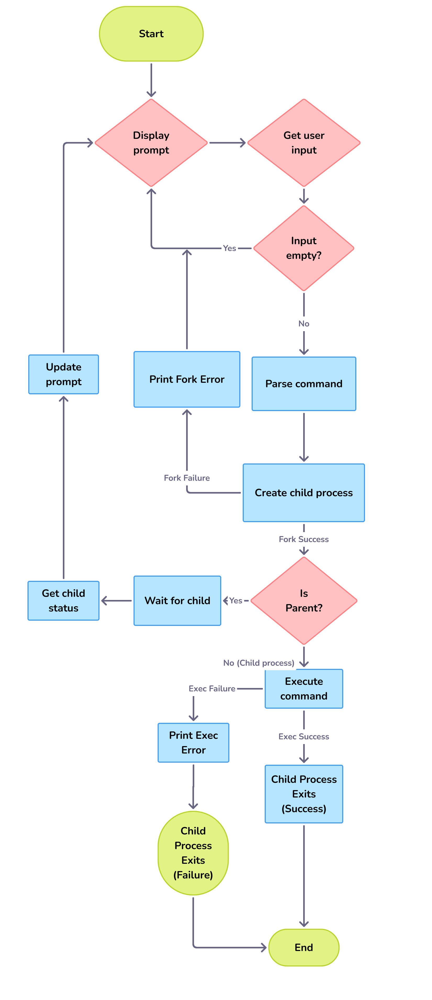

# Simple Shell

A simple implementation of a UNIX shell in C, created as part of the Holberton School curriculum.

## Flowchart



## Description

This project is a minimal UNIX shell inspired by `/bin/sh`. It executes commands using absolute/relative paths or searches them via the `PATH` environment variable. The shell reads commands from standard input, parses them, and executes them using the `fork()` and `execve()` system calls.

## Features

- **Command execution**: Execute any program by absolute/relative path or via `PATH` lookup
- **Interactive & Non-interactive modes**: Works in both interactive mode (with prompt) and piped input
- **Built-in commands**: `exit` and `env`
- **Environment preservation**: Passes environment variables to executed commands
- **Error handling**: Displays error messages matching the format of `/bin/sh`

## Compilation

```bash
make
```

This will compile the project using `gcc` with the following flags:
- `-Wall -Werror -Wextra -pedantic -std=gnu89`

Compiled files: `main.c`, `prompt.c`, `input.c`, `exec.c`, `path.c`, `parser.c`, `builtins.c`

## Usage

### Interactive Mode

```bash
$ ./hsh
#cisfun$ /bin/ls
file1  file2  file3
#cisfun$ ls
file1  file2  file3
#cisfun$ echo "Hello, World!"
Hello, World!
#cisfun$ env
PATH=/usr/local/bin:/usr/bin:/bin
HOME=/home/user
...
#cisfun$ exit
$
```

### Non-Interactive Mode (Pipe Input)

```bash
$ echo "/bin/ls" | ./hsh
file1  file2  file3
$ echo "ls -la" | ./hsh
total 48
drwxr-xr-x  2 user user  4096 Jan  7 10:00 .
...
```

## Implementation Details

### Architecture

- **`main.c`**  
  Entry point and main shell loop.  
  Initializes the shell state (`t_shell` structure), detects interactive mode using `isatty()`, calls `print_prompt()` when needed, reads input via `read_line()`, handles built-in commands by calling `handle_exit()` for `exit` and implementing `env` directly, and dispatches external commands to `run_cmd()`.

- **`prompt.c`**  
  Contains `print_prompt()` which writes the shell prompt (`#cisfun$`) to standard output in interactive mode.

- **`input.c`**  
  Contains `read_line()` which uses `getline()` to read a line from stdin and strips the trailing newline character.

- **`exec.c`**  
  Contains `run_cmd()` which handles external command execution.  
  Uses `parse_args()` from `parser.c` to tokenize the command line into arguments.  
  Resolves command paths (direct path or via `find_in_path()`), forks a child process, executes via `execve()`, and waits for the child using `waitpid()`.

- **`path.c`**  
  Contains `get_path()` to extract the `PATH` value from environment variables, and `find_in_path()` to search for executable commands in `PATH` directories.  
  Used by `exec.c` to resolve commands without `/` in their name.

- **`parser.c`**  
  Contains `parse_args()` and `free_args()` for command line tokenization.  
  Splits the input line into a NULL-terminated argument array by identifying separators (spaces and tabs).  
  Called by `exec.c` to prepare arguments for `execve()`.

- **`builtins.c`**  
  Contains `handle_exit()` which implements the `exit` builtin command.  
  When the user types `exit`, it frees resources and terminates the shell with the last command's exit status.  
  Called by `main.c` during command processing.

- **`shell.h`**  
  Header file with the `t_shell` structure definition, all function prototypes, and required system includes (`stdio.h`, `stdlib.h`, `unistd.h`, `string.h`, `sys/types.h`, `sys/wait.h`, `errno.h`).

### Shell State Structure

All shell state is stored in the `t_shell` structure to avoid global variables:

```c
typedef struct s_shell
{
char *line;          /* Input line buffer */
size_t cap;          /* Buffer capacity */
int status;          /* Last command exit status */
unsigned long lineno;/* Line number for error reporting */
int interactive;     /* Interactive mode flag (0 or 1) */
char *prog;          /* Program name (argv[0]) */
char **env;          /* Environment variables (envp) */
} t_shell;
```

## Constraints

- **No global variables**: All state is managed through the `t_shell` structure
- **Standard C89**: Code follows the GNU89 standard
- **Allowed functions**: Limited to a specific set of standard library functions

### Allowed Functions

The following system calls and standard library functions are permitted:

- `access`, `chdir`, `close`, `closedir`, `execve`, `exit`, `_exit`
- `fflush`, `fork`, `free`, `getcwd`, `getline`, `getpid`
- `getppid`, `getuid`, `isatty`, `kill`, `malloc`, `memset`
- `open`, `opendir`, `perror`, `printf`, `fprintf`, `sprintf`
- `putchar`, `puts`, `read`, `readdir`, `signal`, `stat`, `lstat`, `fstat`
- `strtok`, `wait`, `waitpid`, `write`

## File Structure

```
holbertonschool-simple_shell/
├── AUTHORS
├── Makefile
├── README.md
├── shell.h
├── main.c
├── prompt.c
├── input.c
├── exec.c
├── path.c
├── parser.c
├── builtins.c
├── man/
│   └── hsh.1

```

## Compilation & Testing

### Compile

```bash
make
```

### Clean Object Files

```bash
make clean
```

### Clean Everything (including executable)

```bash
make fclean
```

### Rebuild

```bash
make re
```

## Error Handling

When a command is not found or cannot be executed, the shell displays an error message in the format:

```
./hsh: 1: command_name: not found
```

Where:
- `./hsh` is the program name (`argv[0]`)
- `1` is the line number (input line counter)
- `command_name` is the command that was not found
- Exit status is set to `127` for "command not found" errors

## Authors

- Lucas Mettetal <https://github.com/lucasmettetal>
- Enzo Richard <https://github.com/Nzoowdev>

## Acknowledgments

This project follows the Holberton School simple_shell project specification and Betty coding style guidelines.
